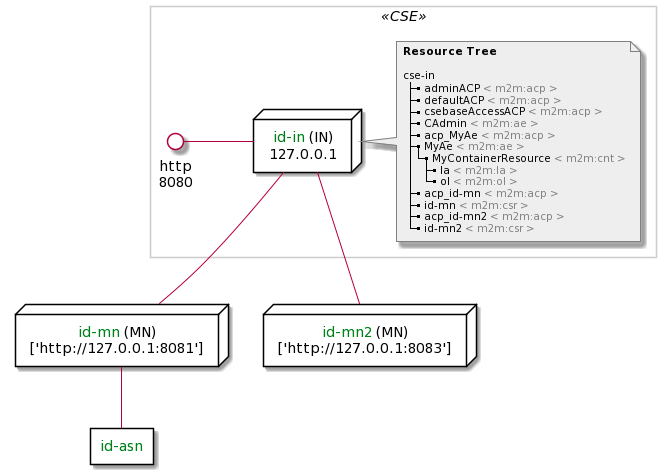

[← README](../README.md) 

# Operation

## Remote CSE

When a CSE is configured as an MN-CSE of ASN-CSE it can connect to a remote CSE, respectively an IN-CSE and MN-CSE can receive connection requests from those CSE types. A &lt;remoteCSE> resource is created in case of a successful registration. A CSE checks regularly the connection to other remote CSEs and removes the *remoteCSE* if the connection could not been established.

Announced resources are currently **not** supported by this implementation. But you can issue transit requests to a remote CSE via its &lt;remoteCSE> resource. These requests are forwarded by the CSE.

You must configure the details of the remote CSE in the configuration file.


## Resource Announcements

Resource announcement is currently allowed for one hop.

When a resource is announced to a remote CSE then access is automatically granted when the announced resource's parent is the CSR of the original resource's hosting CSE.

## CSE Originator Assignment

Whenever a new &lt;ACP> resource is created, the CSE's admin *originator* is assigned to that resource automatically. This way resources can always accessed by this originator.

This behaviour can be configured in the *[cse.resource.acp]* section of the configuration file.


## AE Registration

Whenever a new &lt;AE> registers itself with the CSE (using the originators *C* or *S*) then a new originator for that &lt;AE> is created. Also, the CSE automatically creates a new &lt;>ACP> resource for that new originator.

Be aware that this &lt;ACP> resource is also removed when the &lt;AE> is deleted.

The operations for the &lt;ACP> resource can be configured in the *[cse.resource.acp]* section of the configuration file.


## URL Mappings

As a convenience to access resources on a CSE and to let requests look more like "normal" REST request you can define mappings. The format is a path that maps to another path and arguments. When issued a request to one of those mapped paths the http server issues a redirect to the other path.

For example, the path */access/v1/devices* can be mapped to */cse-mn?ty=14&fu=1&fo=2&rcn=8* to easily retrieve all nodes from the CSE.

See the [configuration](Configuration.md) for more examples.


## Resource Tree and Deployment Infrastructure via http

The CSE can generate a diagram with an overview about the hosted resource tree and the current deployment infrastructure of remote CSE's.

```bash
$ curl localhost:8080/__sturcture__
```



This feature must be enabled in the configuration file under "\[server.http]->enableStructureEndpoint" (see also [Configuration](Configuration.md#server_http)). 

**ATTENTION**: Enabling this feature might reveal sensitive data. It should be disabled if not used.

When enabled the http server creates an additional endpoint */\_\_structure__*. A GET request to that endpoint returns a diagram description in [PlanUML](https://plantuml.com) format that can be transformed in images with various tools (for example, with the online editor on the PlantUML website). An optional argument *lvl=&lt;int>* can be provided to the URL to limit the size of the resource tree in the diagram.

A similar text representation of the resource tree can be retrieved from the endpoint */\_\_structure__/text* .

```bash
$ curl localhost:8080/__structure__/text

cse-in -> m2m:cb (csi=/id-in) | ri=id-in
├── acpCreateACPs -> m2m:acp | ri=acpCreateACPs
└── CAdmin -> m2m:ae | ri=CAdmin
``` 


## Resetting the CSE via http

The CSE can be reset from remote by sending a GET request to the endpoint */\_\_reset\_\_* . This will remove all resources, purge the internal data bases, and do an initial resource import again.

This feature must be enabled in the configuration file under "\[server.http]->enableResetEndpoint" (see also [Configuration](Configuration.md#server_http)). 

**ATTENTION**: Enabling this feature might lead to a total loss of data. It should be disabled if not used.

**Example**

```bash
$ curl localhost:8080/__reset__
```

## Running with MQTT Support

ACME supports Mca and Mcc communication via MQTT. This binding must be enabled in the configuration file under "\[client.mqtt]->enable" (see also [Configuration](Configuration.md#client_mqtt)). 

ACME does not bring an own MQTT broker. Instead any MQTT broker that supports at least MQTT version 3.1.x can be used. This can be either be an own operated or a public broker installation (see, for example, [https://test.mosquitto.org](https://test.mosquitto.org)). The connection details need to be configured in the "[client.mqtt]" section as well.


[← README](../README.md) 
